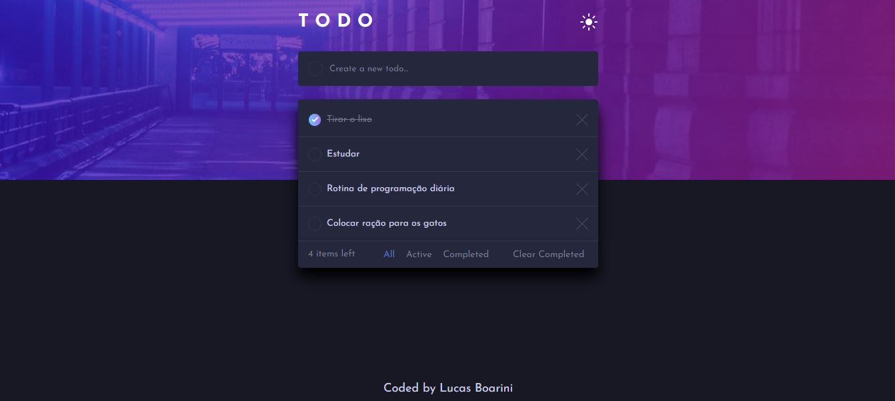
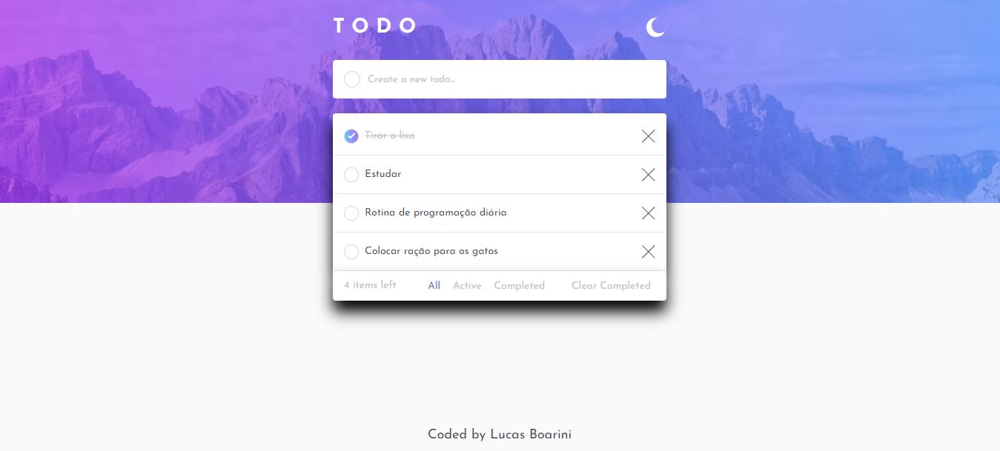

# Comentários Interativos

Nesse projeto irei desenvolver um app de "to do list", lista de afazeres. Esses tipos de listas sempre são úteis para não esquecermos a programação do dia. Neste aplicativo o usuário poderá acrescentar itens à lista, realizar filtros, excluir todos os finalizados ou excluir algum em específico. Também será possível mudar o tema dela.  

## Menu

- [O Projeto](#o-projeto)
- [O que aprendi](#o-que-aprendi)
- [Screenshot](#screenshot)
- [Updates](#updates)
- [Construido com](#construido-com)
- [Link](#link)

### O que aprendi

Durante o desenvolvimento dessa aplicação me deparei com alguns pontos onde tive que estudar para conseguir encontrar a solução, e com isso acabou contribuindo meus aprendizados. Como por exemplo utilizar radio button para fazer os botões de filtro, aprendi como manipular as imagens com o JavaScript de acordo com o tamanho da tela, como criar elementos em HTML pelo JavaScript.

### Screenshot

Abaixo estou deixando um screenshot do resuldado de minha aplicação, nas duas versões de tema.

##### Dark:

##### Light:

### Updates

Assim que publiquei esse projeto, um amigo sugeriu de fazer esse app guardar as informações no localStorage, então decidi implementar no projeto, para ampliar meus conhecimentos com essa ferramenta e também buscando uma melhoria para o app.

Etapas:

- [X] Criar Array para controle da lista de todo;
- [X] Desenvolver função para salvar novos todo no localStorage;
- [X] Criar função para excluir itens específicos da lista;
- [ ] Desenvolver função para excluir todo completos do localStorage;
- [ ] Implementar função para manter todos completos salvos ao recarregar a página;

### Link

No link você será direcionado para o deploy desse App em funcionamento:

- [To Do](https://todo-app-main-bay.vercel.app/)

### Construido com

As tecnologias utilizadas para esse projeto são as listadas abaixo:

- Semantic HTML5 markup
- CSS custom properties
- JavaScript